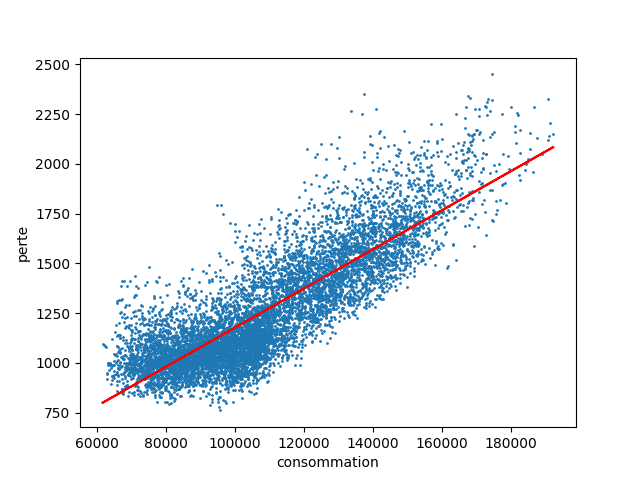
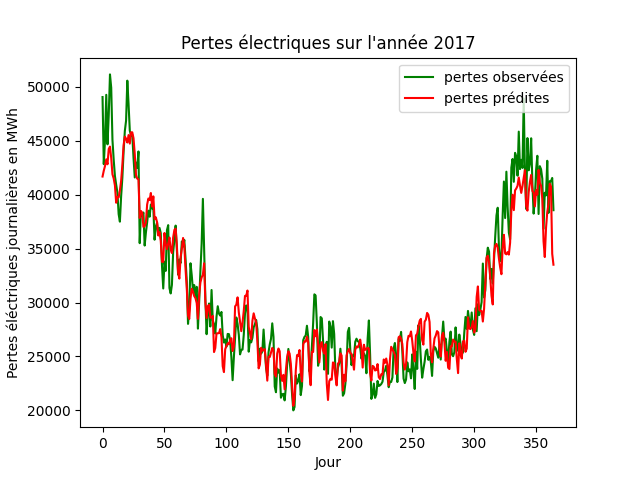

---
title:
- Prévision de pertes RTE
author:
- Pia CHANCEREL, Louis HEMADOU, François MEDINA
date :
- Mai 2020
theme:
- Copenhagen
---

\tableofcontents

# Introduction
## Contexte
* RTE : gestion du réseau haute tension français
* 2,5% de la consommation perdue : 500 M€
* Objectif : modèle de prédiction de pertes

## Problématique
* 35 variables explicatives
* Prédiction à long terme (1 an)

## Ressources
* Base de données : 35 variables et pertes horaires
* Rapport de stage sur la prédiction de pertes

## Objectif
* Identifier les variables significatives
* Identifier et paramétrer un algorithme de prédiction efficace

# Récupération des données
## Réception
* Activité du réseau (consommation, production, énergie) : eco2mix
* Pertes relevées : portail client RTE

## Visualisation
<!--  -->
\includegraphics[scale=.5]{figures/scatter_consommation_2018.png}

## Description
* date/heure : représentatif de l'activité et du climat
* consommation, prévisions : charge et imprévus
* production : régimes d'activation et de charge du réseau
* échanges : charge supplémentaire sur des points individuels

## Traitement des fichiers
* encodage utf-8, comma separated values
* colonnes en `snake_case`
* dates/heures numériques

pertes au même format que les données de consommation/production/échanges :

* élimination des lignes parasites (commentaires)
* un fichier par an
* une ligne par heure (colonnes jour/mois pour accès facile en observation)

# Modèles de prédiction

## Validation d'un modèle

* Validation croisée pour éviter le sur-apprentissage.
* Coefficient de détermination $R^2$ pour expliquer la proportion de variance des pertes expliquée par un modèle.
* Entrainement des modèles avec des données normalisées, standardisées ou orthogonalisées.

## Régression linéaire

Dépendance linéaire à déterminer :

$$
f(x, \epsilon) = \beta_0 + \sum_{j=1}^p \beta_jx^j + \epsilon
$$
Problème d'optimisation à résoudre :

$$
\displaystyle \min_{\beta \in \mathbb{R}^{p+1}} \frac{1}{n}\sum_{i=1}^{n} (y_i - \widetilde{x}_i \beta)^2 + \lambda \left\Vert\beta \right\Vert_2
$$

## Régression linéaire

Résultats selon le pré-traitement des données :

**traitement**    | **$R^2$**
---               | ---
normalisation     | 0.80
standardisation   | 0.83
orthogonalisation | -1.9

## Régression linéaire

De bons résultats en standardisant ou en normalisant les données :
\includegraphics[scale=.5]{figures/2017_st.png}
<!--  -->

## Machine à noyau

Passage au problème dual et introduction du kernel:

$$
\displaystyle \max_{\alpha \in \mathbb{R}^n} \frac{1}{n} \sum_{i=1}^{n} (\alpha_i y_i - \frac{\alpha_i^2}{4}) - \frac{1}{2 \lambda n^2} \sum_{i=1}^n \sum_{j=1}^n \alpha_i \alpha_j K(x_i, x_j)
$$

Noyaux communément utilisés:

* Noyau gaussien: $K(x_i, x_j) = \exp{(-\frac{\left\Vert x_i-x_j\right\Vert ^2}{2 \sigma^2})}$
* Noyau polynomial: $K(x_i, x_j) = (1 + x_i \cdot x_j)^q$

## Machine à noyau

Coefficient de détermination selon le prétraitement :

**traitement**    | **$R^2$**
---               | ---
normalisation     | 0.63
standardisation   | 0.61
orthogonalisation | -0.17

## Machine à noyau
Résultats avec la machine à noyau, données standardisées :
\includegraphics[scale=.5]{figures/svr_2017.png}

## Réseau de neurones
* Utilisation des bibliotheques Keras et Tensorflow
* La complexité se trouvait dans la recherche d'une bonne architecture 
* structure de réseau retenue:

**neurones** | **activation**
---          | ---
400          | sigmoïde
400          | sigmoïde
100          | ReLU
1            | linéaire (sortie)

## Réseau de neurones

**traitement**    | **$R^2$**
---               | ---
normalisation     | 0.86
standardisation   | 0.83
orthogonalisation | 0.48

## Réseau de neurones

Résultats avec un réseau de neurones, données normalisées

\includegraphics[scale=.5]{figures/RN_2017.png}

# Sélection de variables
## Élimination des doublons
Corrélation de Pearson : $\rho(X,Y) = \frac{cov(X, Y)}{\sigma_X\sigma_Y}$
\includegraphics[scale=.4]{figures/heatmap.jpg}

## Élimination des doublons
Coefficient de détermination selon le seuil d'élimination :
\includegraphics[scale=.5]{figures/doublons.JPG}

seuil à $0.8 > 0.65$,
supprimant `consommation`, `prevision_0`, `fioul`, `gaz`, `hydraulique`, `hydro_lacs`,
`taux_co2`, 1.4% de perte

## Sélection des variables explicatives
La corrélation de Pearson ne suffit plus pour l'explication des pertes :

* sensibilité aux valeurs extrêmes
* relations non linéaires

On cherche donc d'autres méthodes.

## Sélection des variables explicatives
Méthodes de filtrage :

* matrices de corrélation (de Pearson)
* PCA (Principal Component Analysis)

## Corrélation avec les pertes
Corrélation de chaque variable avec les pertes :
\includegraphics[scale=.5]{figures/pearson_y.JPG}
Beaucoup de variables peu significatives ($-0.5 < \rho < 0.5$)

## P-value
p-valeur avec `scipy.stats` :
probabilité du même $\rho$ dans un système décorrélé
\includegraphics[scale=.5]{figures/log_p_value.JPG}

## P-value
Sans le log on trouve un outlier :
\includegraphics[scale=.5]{figures/p_value.JPG}
variation des pertes à des échelles plus courtes ou moins longues qu'un jour

## Corrélation avec les pertes
<!-- {mois}, \texttt{jour}, \texttt{solaire}, \texttt{echanges\_italie}, \texttt{echanges\_suisse}, \texttt{bio\_biomasse} et \texttt{bio\_biogaz} : -->
`mois`, `jour`, `solaire`, `echanges_italie`, `echanges_suisse`, `bio_biomasse` et `bio_biogaz` :

* Corrélation à 0
* Pas de relation linéaire : exclues pour la régression linéaire
* En les excluant : $R^2$ de 03805 à 0.799, soit 0.7%
* Comparé au doublons : 2 fois moins de perte, même nombre d'éliminés

## Analyse en composantes principales
Variables $x_i$, covariance $K$, composantes principales $c$ et valeurs propres
$\lambda$ associées aux vecteurs $e$.
Corrélation entre variable et composante principale :

\begin{equation}
\text{Corr}(c^l, x^j) = \frac{\sqrt{\lambda_l}e_l^j}{K_{i,i}}
\end{equation}

## PCA
max des corrélations par variable :
\includegraphics[scale=.5]{figures/max_pca.JPG}

## PCA
somme des corrélations par variable :
\includegraphics[scale=.5]{figures/sum_pca.JPG}

## PCA
* La consommation a un maximum très élevé pour une somme faible :
elle est presque à elle seule une composante principale
* `heure`, `solaire` et certains `echanges` disparaissent en restreignant le nombre de composantes.

## k Nearest Neighbors
\includegraphics[scale=.5]{figures/knn.JPG}

## k-NN
* `mois`, `prevision_1`, `nucléaire` et `gaz_cogen` sont performantes, même avec
peu de voisins
* `solaire` et `gaz_tac` sont peu performantes
* Les autres dans une bande moyennée entre 0.75 et 0.9 : non concluant

## Support Vector Regressor
Noyau gaussien de paramètre 0.001 et constante de tradeoff 1,
entraîné sur 10 époques et 100 observations.
\includegraphics[scale=.5]{figures/svr.JPG}

## SVR
* On retrouve `prevision_1`, `nucleaire` et `gaz_cogen` performants
* Quelques $R^2$ négatifs : susceptibles de fausser les prédictions
`jour`, `echanges_angleterre`, `echanges_italie`, `fioul_tac`, `gaz_tac`

## Poids de la régression linéaire
\includegraphics[scale=.5]{figures/poids.JPG}
Les différences de poids peuvent être dues aux différences d'échelle

## Test de Student sur les poids

$$
f(x, \varepsilon) = \beta_0 + \displaystyle \sum_{j=1}^p \beta_j x^j + \varepsilon
$$

On suppose que les $\varepsilon_i$ sont indépendants et suivent une $\mathcal{N}(0, \sigma^2)$.

Hypothèses nulle et alternative:

$$
H_0 = \{\beta_j = 0\}, H_1 = \{\beta_j \neq 0\}
$$

## Test de Student sur les poids

Le test de Student consiste à rejeter $H_0$ si on a:

$$
\left|\frac{\hat{\beta_j}}{\sqrt{\hat{\sigma}^2 \rho_j}}\right| > t_{n-p-1, 1-\alpha/2}
$$
 
* $\rho_j$ est le j-ième coefficient diagonale de la matrice $(x^Tx)^{-1}$
*  $t_{n-p-1, 1-\alpha/2}$ est le quantile d'ordre $1-\alpha/2$ d'une loi de student à n-p-1 degrés de liberté.
* $\hat{\beta}$ et $\hat{\sigma}$ sont des estimateurs de $\beta$ et $\sigma$.
* $\alpha$ quantifie le niveau du test (erreur de type I)

## Test de Student sur les poids

Résultats:

* On fixe $\alpha$ = $5\%$.
* Le test de Student élimine 23 variables explicatives.
* Réseau de neurones avec données normalisées: $R^2$ = 0.86 $\rightarrow$ $R^2$ = 0.85.

# Conclusion
## Difficultés
* différentes installation python : contournement avec jupyter notebook, organisation du code
* factorisation difficile : beaucoup de paramètres entrent en jeu
* travail à distance

## Résultats
* Élimination de nombreuses variables inutiles ou redondantes, en lien avec intuitions
* Résultats très satisfaisants avec certains modèles

*Variables conservées*      | *$R^2$ de la prédiction obtenue*
---                         | ---
Toutes                      | 0.865
Test de Student             | 0.858
Test de Student inverse     | 0.501
Doublons                    | 0.849
Toutes méthodes considérées | 0.833

## Pour aller plus loin
* Évolution de la relation entre variables explicatives potentielles et pertes
* Transformation préalable des variables (périodicité notamment)

## Remerciements
* Aboubakr MACHRAFI (stagiaire RTE)
* Valentin CADORET, Virginie DORDONNAT (RTE)
* Gabriel STOLTZ (ENPC)
* David PICARD (ENPC)
